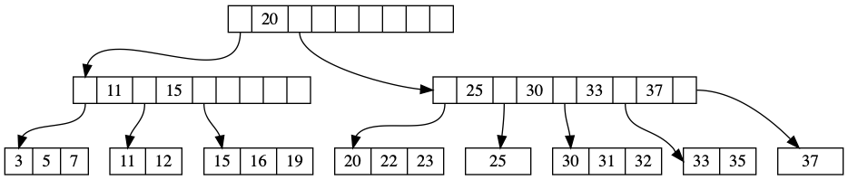
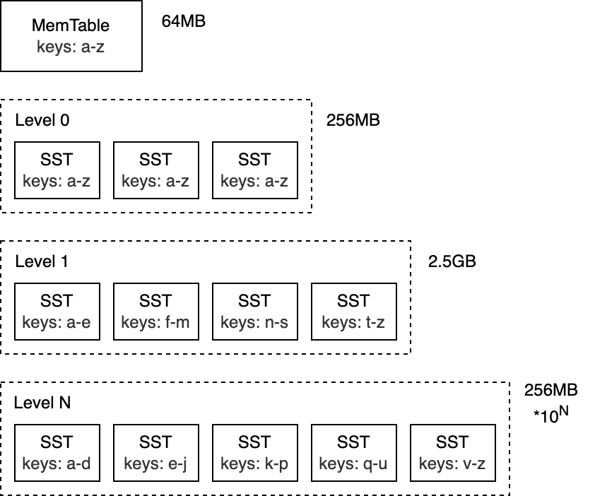
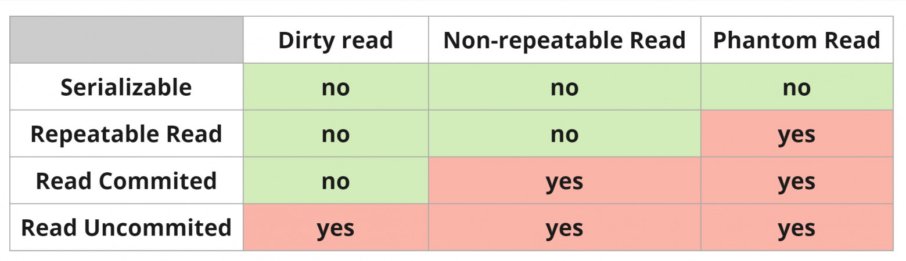
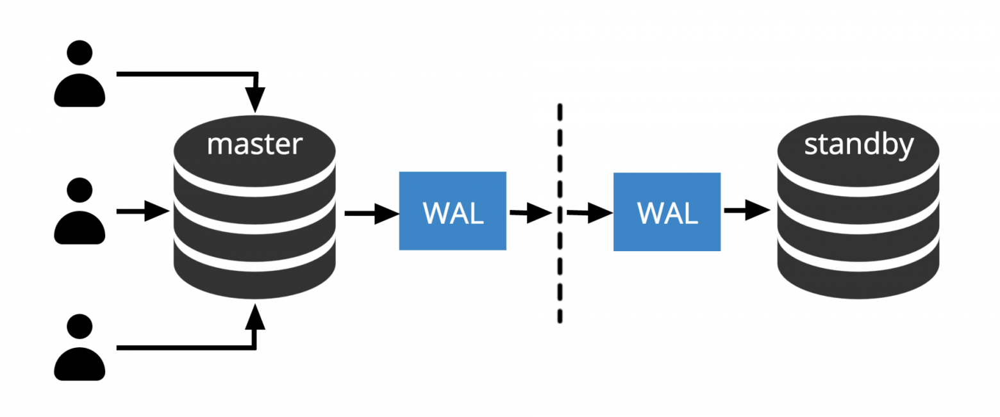
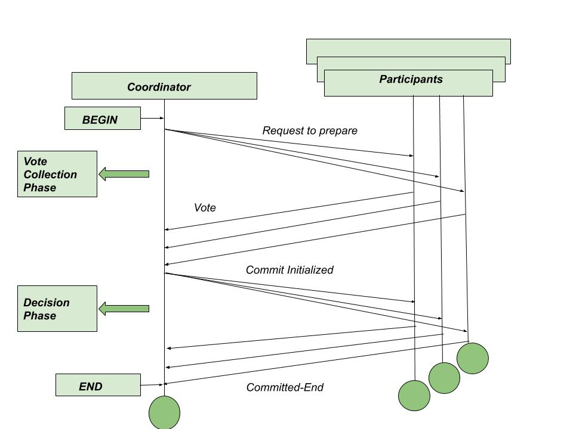
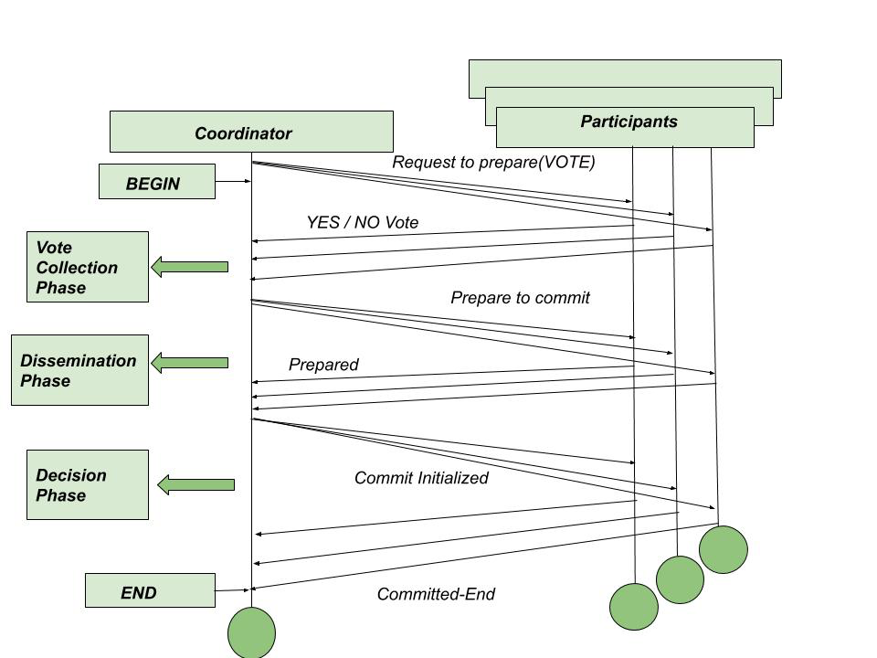
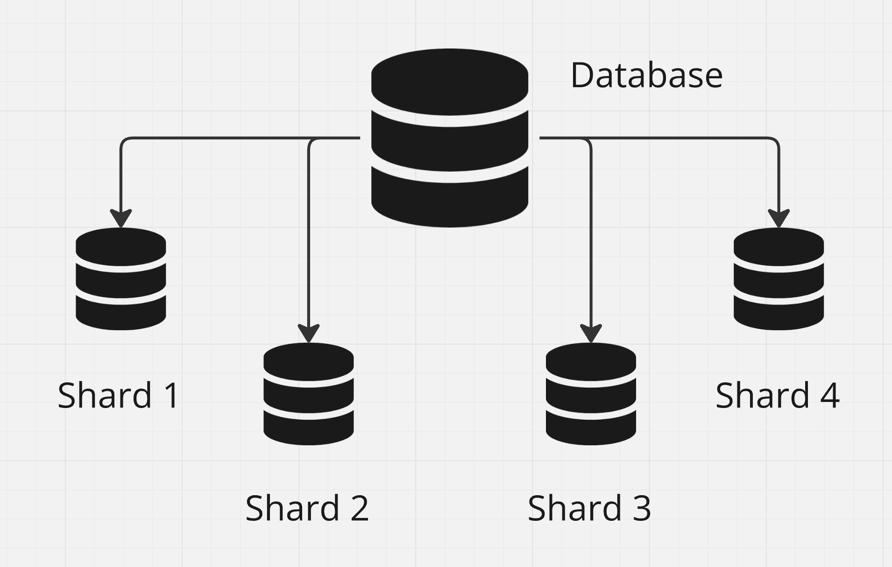
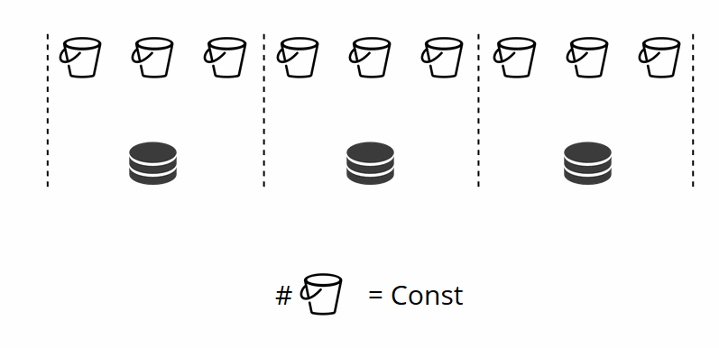

Максим Тремпольцев

Техлид команды архитектуры Яндекс Такси

В IT с 2008 года:
- Acronis
- Лаборатория Касперского
- Mail.Ru (VK)

В Mail.Ru руководил продуктовой разработкой Tarantool (Tarantool Cartridge, Tarantool Data Grid)

## План лекции

1. Основы устройства СУБД
2. Транзакции, уровни изоляции, MVCC
3. Репликация, шардирование

## Напишем свою СУБД чтобы понять принципы работы СУБД

## База

Идеальной СУБД не существует. Выбор следует делать исходя из данных и профиля нагрузки.

### Write Amplification

Отношение размера записываемых данных в СУБД к размеру записываемых данных на диск.

Например, в базу вставили 1 Мб данных, но на диск было записано 2 Мб - write aplification равен 2.

### Read Amplification

Количество чтений с диска необходимых для выполнения запроса.

Например, если для выполнения запроса нужно выполнить 3 чтения, то read amplification = 3.

> Кеширование - ключевой фактор снижения read amplification.

### Space Amplification

Отношение размера данных в БД к размеру занимаемому на диске.

Например, размер данных в БД 1 Мб, но файлы БД на диске занимают 5 Мб - space amplification равен 5.

| | | |
|---|---|---|
| Sequential HDD Read (8 KiB) | 10 ms | 250 MiB/s |
| Random HDD Read (8 KiB) | 10 ms | 0.7 MiB/s |
| Sequential SSD read (8 KiB) | 1 μs | 4 GiB/s |
| Random SSD Read (8 KiB) | 100 μs | 70 MiB/s |
| Sequential Memory R/W (64 bytes) | 0.5 ns | 30 GiB/s |
| Random Memory R/W (64 bytes) | 50 ns | 1 GiB/s |
| Network | | 10-40 GiB/s |
| Network within same region | | 2-25 GiB/s |

Выводы:

- Последовательное чтение гораздо эффективней случайного
- Чтение и запись осуществляется блоками, поэтому важно чтобы связанные данные попадали в один блок (amplification)
- Также из предыдущего тезиса следует, что выгодно откладывать чтение и запись, чтобы за одну операцию выполнить несколько чтений или записей (batching)

## Тестовые данные

| first_name | last_name | phone |
|---|---|---|
| Jeremy | Cooper | +78069094028
| Gregg | Davis | +76285154015

## Представление данных в файле

#### CSV (Comma separated values)

```'phones.csv'```

```
Jeremy,Cooper,+78069094028
Gregg,Davis,+76285154015
```

> Строку из нескольких полей будем называть кортежем (tuple).

## Это хорошее решение?

Да, иногда. Когда оперативной памяти достаточно.

Redis, Tarantool и некоторые другие СУБД хранят данные в виде снепшотов, которые делаются по таймеру.

## Как не потерять данные измененные между двумя снепшотами?

#### WAL (write ahead log)

В файл в режиме append only записываются все произошедшие изменения в виде:

```
add Jeremy,Cooper,+78069094028
del Gregg,Davis
```

После сохранения снепшота WAL-файл очищается.

Таким образом при старте СУБД надо прочитать последний снепшот и применить к нему операции из WAL.

> На самом деле WAL используют не только СУБД с хранением данных в виде снепшотов

### А что если данных слишком много?

То их надо уметь хранить на диске.

#### Понятие блока и страницы

Узнать размер блока устройства:

```bash
stat -f %k .
```

```
4096
```

СУБД может использовать блоки другой величины. Например, PostgreSQL по-умолчанию использует блоки рамером 8192 байт.

```sql
SELECT current_setting('block_size');
```

```
8192
```

Все данные управляемые СУБД делятся на такие блоки (страницы).

### Как хранить строки и массивы?

Длинные кортежи могут выйти за размер одной страницы, что существенно повлияет на производительность. Некоторые СУБД, например, PostgreSQL не позволяют создавать кортежи больше размера страницы.

### TOAST (The Oversized Attribute Storage Technique)

1. Объекты больше TOAST_TUPLE_THRESHOLD (2Кб) сжимаются
2. Если объект получается больше TOAST_TUPLE_TARGET (2Кб), то он перемещается в отдельное хранилище, где хранится чанками

## Методы организации множества страниц

### B+ Tree

Сбалансированное дерево с небольшой высотой, чтобы минимизировать количество обращений к диску.

- Два типа узлов: внутренние и конечные
- Конечные узлы содержат данные и не имеет дочерних узлов
- Внутренние узлы могут содержать [0; N] ссылок на дочерние узлы
- N подбирается под размер блока диска и называется branch factor
- Конечный узел может содержать ссылку на следующий конечный узел



Write amplification - $O(B)$

Read amplification - $log{_B}{N/B}$

> N - размер БД

> B - размер блока

> Для простоты B и N измеряются в фиксированного размера кортежах.

Стандарт хранения данных в дисковых СУБД: PostgreSQL, MySQL, Oracle и т.д.

### LSM-tree (Log-structured merge-tree)

Оптимизированная под запись структура данных состоящая из множества файлов, каждый из которых содержит упорядоченные данные (SS-tables, Sorted Strings). Файлы разделены на уровни.

- Упорядоченная таблица в памяти (mem-table)
- По достижению таблицы определенного размера она сохраняется на диск в виде упорядоченного файла (SS)
- SS-файлы неизменяемы и разделены на уровни
- Время от времени SS-файлы объединяются в один
- Сценарий записи: Просто обновить mem-table
- Сценарий чтения: поиск в mem-table, далее в SS-файлах от верхнего уровня к нижнему
- Для ускорения поиска может использоваться bloom-фильтр



#### Зачем объединять SS-файлы?

- Ускорение поиска
- Освобождение места на диске

Write amplification - $O(k*log{_k}N/B)$

Read amplification - $O(log{^2}{N/B})/logk$

> k - коэффициент роста (то на сколько увеличивается каждый следующий уровень)

> $log{_k}{N/B}$ - количество уровней, если на верхнем уровне один файл размера B

СУБД: RocksDB, Cassandra, Tarantool

### Выводы

- Хранение БД в виде снепшотов хорошо работает для in-memory СУБД
- LSM-дерево очень эффективно при записи, идеально работает при профиле нагрузке append only, например, логи и измерения
- В остальный сценариях обычно лучше B+ дерево

## Представление данных в памяти

Массив из строк вида:

```
0 -> [ Jeremy, Cooper, +78069094028 ]
1 -> [ Gregg, Davis, +76285154015 ]
```

Такое представление в памяти и на диске называется строковым, а СУБД которые его используют оптимизированы под OLTP (Online transaction processing) нагрузку.

Пример: MySQL, PostgreSQL, MongoDB, Tarantool

Типичный сценарий: Необходимо быстро обновить несколько полей одной строки. Например, создание и обновление заказа

## Колоночное представление

[ Jeremy, Gregg ]
[ Cooper, Davis ]
[ +78069094028, +76285154015 ]

OLAP (Online analytical processing)

Пример: ClickHouse, Greenplum

Типичный сценарий: Аналитика или быстрое обновление одного поля (считать клики на банере)

## Чтение таблицы

```python
class Table:
    def read_table(self, file_name):
        self.data = {}
        self.curr_key = 1
        for line in open(file_name):
            fields = line[:-1].split(',')
            self.data[self.curr_key] = fields
            self.curr_key = self.curr_key + 1
```

## Выборка данных

```sql
SELECT first_name, phone FROM phones;
```

```python
class Table:
    def select(self, fields):
        res = []
        for _, row in self.data:
            vals = []
            for field_no in fields:
                vals.append(row[field_no])
            res.append(vals)
        return res
```

```python
phones = Table('phones.csv')
res = phones.select([0, 2])
print(res)
```

```
[['Jeremy', '+78069094028'], ['Gregg', +76285154015']]
```

### DDL (Data definition language)

```sql
CREATE TABLE phones (
    first_name TEXT,
    last_name TEXT,
    phone TEXT
);
```

```json
{
    "fields": [
        "first_name",
        "last_name",
        "phone"
    ]
}
```

```python
class DDL:
    def __init__(self, file_name):
        with open(file_name) as ddl:
            self.ddl = json.load(ddl)

        self.fields = {}
        for i, field_name in enumerate(self.ddl['fields']):
            self.fields[field_name] = i
```

```python
class Table:
    def select(self, fields):
        res = []
        for _, row in self.data:
            vals = []
            for field_name in fields:
                field_no = self.ddl.fields[field_name] # <---
                vals.append(row[field_no])
            res.append(vals)
        return res
```

```python
def read_table(data_file_name, ddl_file_name):
    ddl = DDL(ddl_file_name)
    return Table(data_file_name, ddl)
```

```python
phones = read_table('phones.csv', 'phones.ddl')
res = phones.select(['first_name', 'phone'])
print(res)
```

```
[['Jeremy', '+78069094028'], ['Gregg', +76285154015']]
```

### SQL или NoSQL?

А есть разница?

Важны свойства СУБД и способ организации данных, а не интерфейс взаимодействия с ней. Но, говоря SQL обычно подразумевают организацию БД в реляционной модели и это уже важно.

> Кому интересна теория, читайте Кристофера Дейта "Введение в системы баз данных".

#### 6 нормальных форм

Требования к структуре таблицы в теории баз данных.

```phones```

| first_name | phone |
|---|---|
| Jeremy | +78069094028 |
| Jeremy | +70000000000 |
| Gregg | +76285154015 |

```mobile_ops```

| phone | mobile_op |
|---|---|
| +78069094028 | t2 |
| +70000000000 | mts |
| +76285154015 | t2 |

```phones```

| first_name | phones |
|---|---|
| Jeremy | { +78069094028, t2 }, { +70000000000, mts } |
| Gregg | { +76285154015, t2 } |

### Фильтрация

```sql
SELECT first_name, phone FROM phones WHERE first_name = 'Gregg';
```

```python
class Table:
    def select(self, fields, filter=None):
        filter = self.prepare_filter(filter) # <---
        res = []
        for _, row in self.data:
            if filter.match(row): # <---
                vals = []
                for field_name in fields:
                    field_no = self.ddl.fields[field_name]
                    vals.append(row[field_no])
                res.append(vals)
        return res
```

```python
phones.select(['first_name', 'phone'], where('first_name', '=', 'Erin'))
```

```python
class Filter:
    def match(self, row):
        if not self.is_set():
            return True
        if self.op == '=':
            return self.val == row[self.field_no]
```

### Индексы

```sql
EXPLAIN SELECT first_name, phone FROM phones WHERE first_name = 'Gregg';
```

```
QUERY PLAN
Gather  (cost=1000.00..13561.63 rows=713 width=20)
  Workers Planned: 2
  ->  Parallel Seq Scan on phones  (cost=0.00..12490.33 rows=297 width=20)
        Filter: (first_name = 'Gregg'::text)
```

```sql
EXPLAIN ANALYZE SELECT first_name, phone FROM phones WHERE first_name = 'Gregg';
```

```
QUERY PLAN
Gather  (cost=1000.00..13561.63 rows=713 width=20) (actual time=3.048..45.564 rows=113 loops=1)
  Workers Planned: 2
  Workers Launched: 2
  ->  Parallel Seq Scan on phones  (cost=0.00..12490.33 rows=297 width=20) (actual time=2.632..34.646 rows=38 loops=3)|
        Filter: (first_name = 'Gregg'::text)
        Rows Removed by Filter: 333295
Planning Time: 0.163 ms
Execution Time: 45.663 ms
```

#### Создаем индекс

```sql
CREATE INDEX phones_first_name_idx ON phones(first_name);
```

```sql
EXPLAIN ANALYZE SELECT first_name FROM phones WHERE first_name = 'Gregg';
```

```
QUERY PLAN
Index Only Scan using phones_first_name_idx on phones  (cost=0.42..16.78 rows=706 width=7) (actual time=0.103..0.113 rows=113 loops=1)
  Index Cond: (first_name = 'Gregg'::text)
  Heap Fetches: 0
Planning Time: 0.115 ms
Execution Time: 0.137 ms
```

Разница: 0.137 ms и 45.663 ms - 333 раза!

```sql
EXPLAIN ANALYZE SELECT first_name, phone FROM phones WHERE first_name = 'Gregg';
```

```
QUERY PLAN
Bitmap Heap Scan on phones  (cost=9.87..2091.61 rows=703 width=20) (actual time=0.178..1.681 rows=113 loops=1)
  Recheck Cond: (first_name = 'Gregg'::text)
  Heap Blocks: exact=111
  ->  Bitmap Index Scan on phones_first_name_idx  (cost=0.00..9.70 rows=703 width=0) (actual time=0.110..0.110 rows=113 loops=1)|
        Index Cond: (first_name = 'Gregg'::text)
Planning Time: 0.119 ms
Execution Time: 0.445 ms
```

> Разница: 0.137 ms и 0.445 ms - 3.2 раза

```sql
SET enable_bitmapscan TO off;
EXPLAIN ANALYZE SELECT first_name, phone FROM phones WHERE first_name = 'Gregg';
```

```
QUERY PLAN
Index Scan using phones_first_name_idx on phones  (cost=0.42..2700.59 rows=703 width=20) (actual time=0.094..1.059 rows=113 loops=1)|
  Index Cond: (first_name = 'Gregg'::text)
Planning Time: 0.123 ms
Execution Time: 0.407 ms
```

> Разница: 0.407 ms и 0.445 ms

#### Почему планировщик выбрал менее эффективный план?

Стоимость операций по-умолчанию не совсем соответсвует реальной стоимости операций на моем ноутбуке.

Эти параметры можно настраивать.

#### Виды сканирования таблиц

- Seq Scan - последовательное сканирование
- Bitmap Index Scan/Bitmap Heap Scan - из индекса составляется карта страниц, которые содержат данные, после этого страницы последовательно сканируются
- Index Scan - сканирование по индексу с последующим получением данных из страниц
- Index Only Scan - сканирование только по индексу, если индекс содержит все данные для запроса

### Покрывающий (covering) индекс

 Индекс, которого достаточно для ответа на запрос без обращения к самой таблице.

### Реализуем индекс

```json
{
    "fields": [
        "first_name",
        "last_name",
        "phone"
    ],
    "indexes": [
        "first_name"
    ]
}
```

```python
class Table:
    def __init__(self, file_name, ddl):
        timer = Timer()
        self.read_table(file_name)
        self.ddl = ddl
        self.build_indexes() # <---


    def build_indexes(self):
        self.indexes = {}
        for idx_name in self.ddl.ddl['indexes']:
            idx = {}
            field_no = self.ddl.fields[idx_name]
            for key, row in self.data.items():
                val = row[field_no]
                if val in idx:
                    idx[val].add(key)
                else:
                    idx[val] = {key}
            self.indexes[idx_name] = idx
```

Индекс - структура данных оптимизированная под поиск и ссылающаяся на конкретные кортежи.

Индексы могут строится при загрузке данных (Tarantool) или хранится на диске в виде B-деревьев (PostgreSQL).

Чем более уникальны значения, тем эффективней индекс.

Пример: если в БД пользователей есть колонка "пол", то нет смысла строить по ней индекс, так как это будут просто два огромных бакета, которые так же придется полностью перебрать.

### Частичные (partial) индексы

Индекс, который строится по подмножеству строк таблицы, определяемому условным выражением (оно называется предикатом частичного индекса). Такой индекс содержит записи только для строк, удовлетворяющих предикату.

```sessions```

| first_name | session_id |
|---|---|
| Jeremy | NULL |
| Gregg | FC9089AC-2273-4730-B47C-D6E63C8DB1C3 |

```sql
CREATE INDEX sessions_idx ON sessions (session_id)
WHERE session_id IS NOT NULL;
```

### Планирование запроса

```python
class Table:
    def select(self, fields, filter=None):
        filter = self.prepare_filter(filter)
        res = []
        for _, row in self.plan(filter): # <---
            if filter.match(row):
                vals = []
                for field_name in fields:
                    field_no = self.ddl.fields[field_name]
                    vals.append(row[field_no])
                res.append(vals)
        return res
```

Сам планировщик:

```python
class Table:
    def plan(self, filter):
        if filter.is_set() and filter.name in self.indexes:
            return self.idx_scan(filter.name, filter.val)
        else:
            return self.seq_scan()
```

Стратегии сканирования:

```python
class Table:
    def seq_scan(self):
        for key, row in self.data.items():
            yield key, row


    def idx_scan(self, idx_name, val):
        for key in self.indexes[idx_name][val]:
            yield key, self.data[key]
```

### Удаление

```python
class Table:
    def delete(self, filter):
        filter = self.prepare_filter(filter)
        to_delete = []
        for key, row in self.plan(filter):
            if filter.match(row):
                to_delete.append(key)
        for key in to_delete:
            for idx_name in self.ddl.ddl['indexes']:
                field_no = self.ddl.fields[idx_name]
                row = self.data[key]
                idx_val = row[field_no]
                self.indexes[idx_name][idx_val].remove(key)
            del self.data[key]
```

Удаление требует изменения B-дерева, поэтому их стараются отложить - помечают кортеж как удаленный. Это приводит к тому, что в базе появляется множество "мертвых" строк.

```sql
SELECT schemaname, relname, n_dead_tup FROM pg_stat_all_tables;
```

В PostgreSQL для физического удаления "мертвых" строк работает фоновый процесс (Vacuum).

## Выводы

- Индексы помогают ускорить чтение, но для этого индексы должны иметь хорошую селективность
- Индексы замедляют операции вставки/изменения/удаления

## Транзакции

Транзакция — группа последовательных операций, которая представляет собой логическую единицу работы с данными. Транзакция может быть выполнена либо целиком и успешно, соблюдая целостность данных и независимо от параллельно идущих других транзакций, либо не выполнена вообще, и тогда она не должна произвести никакого эффекта.

```sql
BEGIN;
UPDATE wallets SET balance = balance - 50 WHERE wallet_id = '123';
UPDATE wallets SET balance = balance + 50 WHERE wallet_id = '456';
COMMIT;
```

Набор требований к транзакциям - ACID (Atomicity, Consistency, Isolation,
Durability).

### Атомарность (Atomicity)

Атомарность гарантирует, что каждая транзакция будет выполнена полностью или не будет выполнена совсем.

### Согласованность (Consistency)

Каждая успешная транзакция по определению фиксирует только допустимые результаты.

```sql
CREATE TABLE products (
    product_no integer,
    name text NOT NULL,
    price numeric CHECK (price > 0)
);
```

### Изолированность (Isolation)

Во время выполнения транзакции параллельные транзакции не должны оказывать влияния на её результат.

## Нарушения изолированности

### Потерянная запись (Lost Update)

Транзакции могут одновременно изменять одни данные перезаписывая чужие изменения.

### Грязные чтения (Dirty Read)

Чтение изменений сделанных другими транзакциями, которые еще не завершились.

1. Транзакция 1 списала деньги, но COMMIT еще не сделан
2. Транзакция 2 видит, что денег стало меньше

### Неповторяющееся чтение (Non Repeatable Read)

Транзакция читая одни и те же данные может получать разные значения, так как они были изменены другими транзакциями.

Отличие от грязного чтения - транзакция видит изменения от успешно завершенных транзакций.

### Фантомное чтение (Phantom Read)

1. Транзакция 1 выбрала кортежи по некоторому критерию, например, получилось 100 кортежей
2. Транзакция 2 добавила или удалила кортежи
3. Транзакция 1 снова выбрала кортежи по тому же критерию и получила другое количество

Отличие от неповторяющегося чтения в том, что меняются не только данные в строках, но и их количество.

## Уровни изоляции

### Read Uncommited

Транзакция может читать не зафиксированные изменения других транзакций.

### Read Commited

Транзакция читает только зафиксированные изменения.

### Repeatable Read

Транзакции не могут изменять строки прочитанные другой транзакцией.

### Serializable

Зависимые транзакции выполняются последовательно.



#### Выводы:

- Serializable дает самые строгие гарантии, но и больше снижает производительность СУБД
- В PostgreSQL уровень изоляции по-умолчанию Read Commited
- Уровень изоляции можно изменить

```sql
SET TRANSACTION SERIALIZABLE | REPEATABLE READ | READ COMMITTED | READ UNCOMMITTED;
```

## За счет чего достигается нужный уровень изоляции?

- Блокировки
- Версионирование

### Блокировки

- На всю таблицу
- На строки

Идентификатор транзакции - монотонно возрастающее число. К кортежу можно добавить этот идентификатор, как признак блокировки.

#### Почему надо избегать долгих транзакций?

Потому, что они могут заблокировать другие транзакции.

### Версионирование

#### MVCC (Multiversion Concurrency Control)

- Каждая транзакция получает свой набор данных (снепшот)
- Менеджер транзакции фиксирует или отклоняет транзакции

#### Достоинства

- Можно получить изоляцию любого уровня
- Нет блокировок${^*}$
- Допустимы долгие транзакции

#### Недостатки

- Риск отклонения транзакции: менеджер транзакций может найти несоответствие и отклонить транзакцию
- Для поддержки множества параллельных снапшотов надо много ресурсов
- Сложнее в разработке

### Надёжность (Durability)

Если пользователь получил подтверждение от системы, что транзакция выполнена, он может быть уверен, что сделанные им изменения не будут отменены из-за какого-либо сбоя.

### Как гарантировать, что данные не будут потеряны?

- ОС имеет кеш, но есть опция сбросить кеш на диск
- Диск имеет кеш, но диски могут иметь батарею для завершения записи при потере питания
- Диск может зеркалироваться (RAID)
- Сервер может выйти из строя целиком или ДЦ может стать недоступен

### Репликация

```
master/leader/primary --- data ---> replica/follower/slave/standby
```

Идея: каким-то образом на реплике поддерживать данные в состоянии как на мастере, тогда в случае выхода из строя мастера, можно сделать реплику мастером и продолжить работу.

- Реплик может быть больше одной
- Реплики можно использовать для того, чтобы выполнять на них запросы на чтение
- Возможны разные конфигурации, например, мастер-мастер

#### Физическая потоковая репликация



#### Асинхронная репликация

Обычно мастер отправляет реплике то, что записывается в WAL-файл, а реплика применяет журнал к своей копии БД.

При данном способе репликации на реплике всегда есть небольшое отставание от мастера. Это значит, что при выходе мастера из строя возможна потеря части данных.

#### Синхронная репликация

Мастер перед тем как зафиксировать транзакцию получает от реплики подтверждение того, что данные ей получены и готовы быть применены.

При данном способе репликации на реплике всегда состояние как на мастере. Платой за это является падение производительности.

#### Двухфазный коммит (Two-phase commit, 2pc)



#### Трехфазный коммит (Three-phase commit, 3pc)



Промежуточная фаза нужна для того, чтобы появилось знание, что был достигнут консенсус о применении транзакции между участниками.

### Синхронная или асинхронная репликация?

#### CAP-теорема

В распределенной системе возможно выбрать только 2 из 3-х свойств:

- C (consistency) — согласованность. Каждое чтение даст вам самую последнюю запись
- A (availability) — доступность. Каждый узел (не упавший) всегда успешно выполняет запросы (на чтение и запись)
- P (partition tolerance) — устойчивость к распределению. Даже если между узлами нет связи, они продолжают работать независимо друг от друга

На самом деле, если у нас больше одного сервера обрабатывающего запросы, то мы уже выбрали P, поэтому выбирать можем только между A и C.

- Синхронная репликация - согласованность (CP)
- Асинхронная репликация - доступность (AP)

### Что происходит после поломки мастера?

- Ручное переключение мастера
- Автоматическое переключение (failover)

#### Автоматическое переключение

Необходимо выбрать новый мастер и реплики могут сделать это самостоятельно (RAFT). Для достижения консенсуса требуется N/2+1 доступных реплик.

#### Split-brain

1. Старый мастер потерял сетевую связанность с остальным кластером
2. Был выбран новый мастер
3. Часть пользовательских запросов продолжил обрабатывать старый мастер, часть новый
4. Имеем два набора возможно противоречивых данных

#### Fencing

Защитный механизм защищающий от split-brain. Мастер потеряв связанность с остальным кластером, должен через заданное время перестать считать себя мастером.

С другой стороны, возможно он действительно остался один и перестав обрабатывать запросы произошел полный отказ СУБД.

#### Внешний координатор

- Живой человек
- Система находящаяся в стороне от кластера и управляющая им

## Данных больше чем может поместиться на одном сервере или недостаточно производительности

### Шардирование данных

Разбить все данные на несколько частей, каждую часть пусть обрабатывает отдельный сервер.



По какому принципу разделить данные? Например, по остатку от деления от хеша первичного ключа. Ключ по которому происходит шардирование - ключ шардирования.

```python
shard_num = 4
shard_no = hash(row.pk) % shard_num
shards[shard_no].insert(row)
```

#### Как получить данные?

Если есть ключ, по которому происходит шардирование, то получение номера шарда и запрос на нем.

Если ключа нет, то MapReduce.

#### MapReduce

Выполнить один запрос на всех шардах, после чего аггрегировать ответы.

### Виртуальные бакеты

Если данных становится так много, что они не помещаются на имеющиеся шарды, то добавляют еще - это называется решардингом.

Для упрощения этого процесса есть приемы, например, виртуальное шардирование.



- Определяется N бакетов, где N может быть десятки тысяч
- Бакеты распределяются между шардами поровну
- При добавлении нового шарда бакеты перераспределяются
- Требуется отдельный компонент - роутер, который хранит информацию о соответствии бакета физическому шарду

## Так какую базу данных выбрать?

- Универсального ответа нет, надо смотреть на характер данных и профиль нагрузки
- Для OLTP-нагрузки, если время доступа не критично и не требуется шардирование я выбираю PostgreSQL
- Если время доступа критично, то in-memory решение, например, Tarantool или Redis
- Если данных очень много и основной профиль нагрузки на чтение - чтение по ключу - YDB
- Все рекомендации субъективны и в основном обусловлены личным опытом

## Ссылки

https://github.com/sirupsen/napkin-math

https://tikv.org/deep-dive/key-value-engine/b-tree-vs-lsm/

https://habr.com/ru/companies/vk/articles/740108/

https://habr.com/ru/companies/vk/articles/436916/
