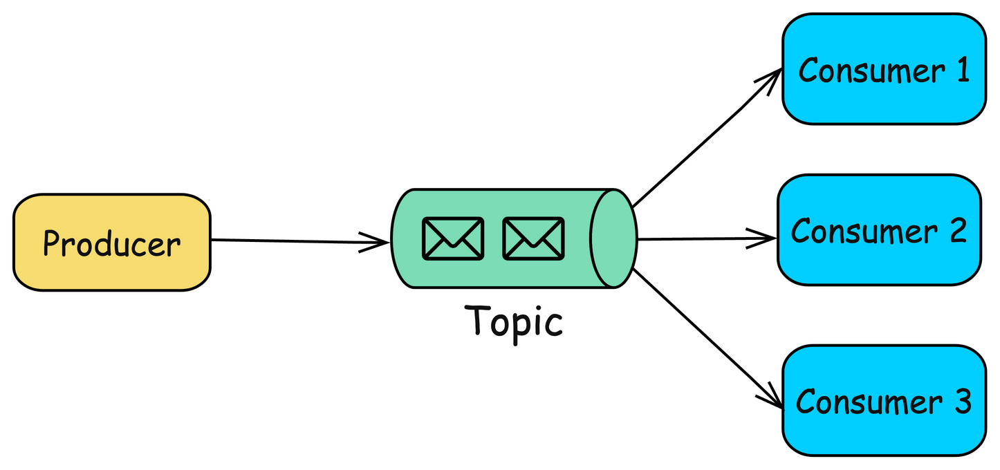
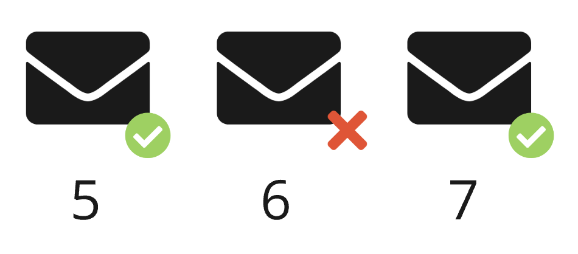

# Очереди сообщений (Message Queues)

- pub/sub (push)
- request/response (pull)

#### push

- Брокер отправляет сообщения потребителю
- Ниже задержки

> RabbitMQ

#### pull

- Потребитель делает запрос брокеру
- Потребители сами контролируют нагрузку
- Пакетная обработка

#### pull + long polling

- Потребитель делает запрос брокеру и в случае если нет сообщений ожидает их
- Плюсы push и pull

> Kafka

## Гарантии доставки сообщений

- Сеть ненадежна
- Программы ненадежны
- Оборудование ненадежно

### Не больше одного раза (at most once)

1. Взять сообшение из очереди
2. Удалить из очереди
3. Отправить сообщение
4. Забыть про него

### Хотя бы один раз (at least once)

1. Взять сообшение из очереди
2. Отправить сообщение
3. Дожаться подтверждения о получении
4. Удалить сообщение
5. Если подтверждения не было, перейти к п. 1

Или переложить ответсвенность на принимающую сторону:

1. Присвоить сообщениям уникальный монотонно возрастающий номер
2. Потребитель перезапрашивает сообщения с пропущенными номерами

Ограничение: потребитель должен быть один.

### Ровно один раз (exactly once)

#### Задача двух генералов

- В долине находится войско неприятеля
- С одной стороны находится одна армия союзников, с другой стороны другая
- Если атакует одна армия, то она гарантированно уничтожается
- Если напасть одновременно, то уничтожается неприятель
- Надо договорится о времени одновременной атаки
- Можно отправлять гонцов, гонцов неприятель может перехватить

#### Попытка достижения нужного результата

1. Сообщения получают уникальный идентификатор
2. Брокер отправляет сообщения пока не получит подтверждение
3. Потребитель выполняет дедупликацию

Ограничение: потребитель должен быть один.

Удалось гарантировать доставку, но гарантировать обработку ровно один раз все равно невозможно:

1. Есть список полученных сообщений
2. Берем сообщение
3. Выполняем работу
4. Удаляем сообщение

> Решает проблему идемпотентность выполняемой работы, но она не всегда достижима.

## Топологии очередей

### Один брокер

Масшабируемость | Доступность | Надежность
---|---|---
Отсутствует | Низкая | Низкая

### Несколько брокеров

Масшабируемость | Доступность | Надежность
---|---|---
Есть | Высокая | Средняя

### Несколько брокеров и дублирование сообщений

Масшабируемость | Доступность | Надежность
---|---|---
Есть | Высокая | Высокая

> Требуется идемпотентность или дедупликация.

### Репликация

Масшабируемость | Доступность | Надежность
---|---|---
Есть | Высокая | Высокая

## Видеоплатформа

### Загрузка нового видео пользователем

1. Проверить видео модератором
2. Если проверка пройдена, то:
   1. Закодировать с разным разрешением
   2. Обновить поисковые индексы
   3. Обновить ленты подписчиков

### Что может пойти не так?

1. Сервис модерации не доступен
2. Прошли модерацию, но упал API Gateway
3. Прошли модерацию, но недоступен Encoder, Indexer или User Feeds
4. Запросы приходят чаще, чем один и больше сервисов способны их обработать

### Что делать?

На стороне API Gateway:

1. Входящий запрос сохранять в таблицу в виде запросов в сервисы, которые нужно сделать
2. После успешного запроса в сервис удалять из базы соответствующую запись
3. Периодически повторять запросы, которые не были успешно выполнены

### Архитектура с использованием очередей

1. Убрали состояние из API Gateway
2. Получили гарантии доставки
3. Добавили эластичность
4. Уменьшили связанность
5. Сократили задержки
6. Избежали ситуации когда один сервис может перегрузить другой сервис
7. Отказались от повторов в случае ошибок
8. Появилась возможность легко горизонтально масштабироваться

### Планирование исполнения

## Популярные очереди сообщений

### Self hosted

1. RabbitMQ
2. Apache Kafka
3. NATS
4. ZeroMQ
5. ...

### На основе СУБД

1. PgQueue
2. Redis
3. ...

### Облачные

1. Amazon SQS
2. Yandex MQ
3. CloudAMQP (RabbitMQ)
4. ...

## RabbitMQ

1. pub/sub брокер
2. Протоколы: AMQP, MQTT, STOMP
3. Приоритеты, отложенные задачи
4. Сильно деградирует под нагрузкой
5. Доставленные сообщения удаляются

1. Exchange могут соединятся с другими Exchange или с собственно очередями (queue) образуя маршруты (route)
2. Очереди могут хранить сообщения только в памяти или обеспечивать их сохранность (durable)
3. Producer шлет сообщения в Exchange, пройдя по маршруту сообщение оказывается в очереди
4. Потребитель (consumer) подписывается на конкретную очередь и начинает получать сообщения из нее
5. Для очереди можно установить максимальный размер или TTL для сообщений
6. Очереди могут реплицироваться (Quorum Queues)

Exchange | Описание
---|---
Direct | Прямая отправка сообщений в одну или несколько очередей с совпадающим значением ключа маршрутизации (routing key)
Topic	| Сообщение отправляется в очереди по значению ключа маршрутизации (routing key), заданного по шаблону
Fanout | Все сообщения отправляются во все очереди независимо от ключа маршрутизации
Headers | Маршрутизация по атрибутам, заданным в заголовке сообщения

### Масштабирование RabbitMQ

Масштабирование в основном вертикальное, но возможно очереди распределить между узлами

## Kafka

1. Производительная
2. Хорошо горизонтально масштабируется
3. Оптимизирована под пакетную обработку
4. Гарантии последовательной обработки
5. Отсутствие приоритетов сообщений
6. Возможность повторного получения сообщений
7. Ограниченное количество потребителей

1. Логический топик делится на партиции
2. Разные партиции могут находится на разных серверах
3. Для продюсера есть стратегии записи в партиции по кругу (round robin) и по хешу от ключа сообщения, таким образом если у сообщения есть ключ, то сообщения с одним ключом попадают в одну партицию
4. Партиции реплицируются между узлами кластера
5. Потребители обьединяются в группы (consumer group), гарантируется, что из одной партиции читает один член группы
6. Разные группы потребителей могут читать одни и те же сообщения
7. У каждого члена группы свое смещение (offset) в партиции, которое указывает на последнее полученное сообщение

### Масштабирование Kafka

- Кластер состоит из узлов - брокеров
- Партиция - основа горизонтальной масштабируемости
- Партиции распределяются между брокерами с указанным replication factor
- Партиция физически состоит из файлов-сегментов, которые реплицируются между брокерами
- У каждой партиции есть лидер
- Клиенты (продьюсеры и потребители) получают информацию о том, кто лидер партиции от любого брокера в кластере

### Что выбрать?

#### Коммуникация между сервисами

- Высокая пропускная способность, масштабируемость
- Потеря сообщений некритична

NATS

#### Сложный роутинг

А точно нужно?

#### Во всех остальных случаях

Kafka

### Dead letter queue (repair queue)

- Отбросить
- Повторить с номера 6
- Переместить в другую очередь

### CQRS (Command and Query Responsibility Segregation)

Подход к проектированию системы, который разделяет операции чтения и записи данных на две отдельные модели.

- Queries - методы, которые возвращают результат, не изменяя состояние объекта
- Commands - методы, которые изменяют состояние объекта

- Сложное взаимодействие
- Много запросов

- Простота
- Производительность
- Масштабирование

### Transactional outbox

1. Получили сообщение
2. Создали во внутренней базе запись со статусом проверки
3. Проверка прошла
4. Отправили сообщение в следующую очередь
5. Удалили запись

1. Получили сообщение
2. Создали во внутренней базе запись со статусом проверки
3. Проверка прошла
4. В транзакции удалили запись и сделали запись в другой таблице
5. Отдельный процесс читает вторую таблицу, отправляет сообщения и удаляет записи (at least once)

### Мониторинг очередей

1. Количество необработанных сообщений. Нормальное состояние - очередь пустая
2. Время
   1. Полное время обработки сообщения (QoS)
   2. Время обработки потребителем
3. Количество повторов и отказов
4. Количество сообщений

### Логирование сообщений

В крайнем случае можно будет восстановить данные распарсив логи.

## Проектируем ленту новостей

- Пользователи могут размещать посты (текст и медиафайлы)
- Другие пользователи, подписанные на этого пользователя должны увидеть в своей ленте новостей эти посты
- Лента формируется от новых постов к старым
- Когда пользователь размещает новый пост кго подписчики должны получать push-уведомление

## Ссылки

https://nats.io/
https://www.cloudamqp.com/blog/reasons-you-should-switch-to-quorum-queues.html
https://github.com/rabbitmq/rabbitmq-sharding

